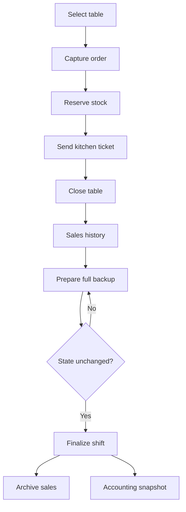

# Rumi Wawqi POS

[](https://github.com/Jsantiagom11/rumi-wawqi-pos/actions/workflows/quality.yml)


Offline-first restaurant operations dashboard designed for weekend service and events in Caraz, Peru. It runs locally on an iPad without a server, printer or permanent internet connection.

**[Read the real operational case study →](docs/case-study.md)**

## Business problem

Rumi Wawqi serves regular weekends and high-volume events. The operation needs a resilient way to coordinate tables, kitchen tickets, menu stock, cash closure and sales reporting even when connectivity is unreliable.

## What the system does

- Table lifecycle and editable table names
- Order capture with inventory reservation
- Kitchen dispatch queue and preparation notes
- Dynamic off-menu items
- Cash totals, average ticket and product mix
- Offline persistence through `localStorage`
- Non-destructive JSON shift backups
- ISO timestamps and audit-friendly closure snapshots
- WSL domain engine for explicit shift finalization/recovery
- Accounting Lab snapshots derived from real shift data

## Operational flow



## Run locally

The browser application has no runtime dependencies.

```bash
npm run serve
```

Open `http://localhost:8080`. The current production UI can also run directly from `app/index.html`.

## WSL workflow

Requires Node.js 20+; no `npm install` is needed because the validation/CLI layer uses only Node built-ins.

```bash
make check
make audit-demo
make finalize-demo
```

Useful commands:

```bash
npm run audit -- fixtures/sample-shift-v2.json
npm run recovery:check -- /path/to/backup.json
npm run scenario -- /path/to/accounting-snapshot.json
npm run finalize:simulate -- /path/to/database.json /tmp/rumi-close
```

See **[docs/WSL_RUNBOOK.md](docs/WSL_RUNBOOK.md)** for the complete operational and recovery workflow.

## Tests

```bash
npm test
# or
make check
```

The suite now combines legacy browser regression checks with behavioral domain/CLI tests. It protects active-order safety, pending kitchen work, two-phase finalization, immutable pre-close backups, stale/foreign/corrupt backup rejection, schema migration, integer-cent monetary calculations, recovery guards and deterministic Accounting Lab scenarios.

CI runs the same `make check` contract on Node 20 and 22.

## Shift finalization contract

The WSL/domain engine uses a fail-closed two-phase protocol:

1. Validate the current shift.
2. Refuse finalization while tables or kitchen tickets are active.
3. Create a complete database snapshot and integrity checksum.
4. Revalidate that the state has not changed since the snapshot.
5. Archive closed sales, preserve previous closures, open a new shift and generate an Accounting Lab snapshot.

A backup generated before later state changes cannot authorize finalization.

## Recovery contract

Recovery validates backup kind/version, schema compatibility, checksum and internal sale totals. It refuses to overwrite a currently active table unless an explicit override is supplied by the caller.

The checksum is intended for accidental corruption detection, not cryptographic authentication.

## Accounting Lab

The educational layer is intentionally outside the critical closing path. A snapshot records real tickets, gross sales, item count and product mix. Training scenarios may derive a hypothetical discrepancy, but the output clearly separates `realBasis` from `hypothetical` values so a simulated variance cannot be confused with a real shortage or surplus.

## Architecture decisions

| Decision | Reason | Trade-off |
|---|---|---|
| Single-file browser application | Simple iPad deployment and offline recovery | Larger UI source file |
| Pure Node domain engine | Testable WSL contract with zero dependencies | UI integration is a separate release step |
| `localStorage` in current UI | No server or account required | Device-local durability |
| Stock reserved on order | Prevents overselling during service | Voided orders must restore stock |
| Two-phase finalization | Backup exists before archival mutation | Adds an explicit prepare/commit protocol |
| Integer cents | Avoid floating-point cash drift | Boundary conversion is required |
| Full snapshot + checksum | Detect corrupt/stale recovery artifacts | Checksum is not a security signature |

## Safety improvements

### v2.1 domain layer

- Complete pre-finalization database snapshots.
- Active-table and pending-kitchen blockers.
- Stale/foreign/corrupt backup rejection.
- Recovery schema/integrity validation.
- Accounting Lab snapshot generation outside the critical close path.
- WSL CLI, Makefile and expanded rainy-day regression suite.

### v2 browser baseline

- Replaced destructive **Bajar Caja** behavior with persistent shift backups.
- Added ISO timestamps to sales, orders and kitchen tickets.
- Added a schema version and migration for existing device data.
- Renamed misleading **Liberar e Imprimir** action because no printer integration exists.
- Added automated regression checks for critical cash-history invariants.

## Roadmap

- Wire the tested v3 shift engine into the single-file iPad UI without breaking direct-file deployment
- IndexedDB persistence and automatic backup rotation
- Receipt PDF generation and optional print adapter
- Payment-method reconciliation
- Inventory movements and waste tracking
- In-app recovery screen with explicit authorization

See [CHANGELOG.md](CHANGELOG.md) for released capabilities and safety changes.

## Context

This is a real operational product, not a synthetic tutorial. It demonstrates offline product design, workflow automation, inventory control, resilience and delivery decisions under practical infrastructure constraints.
