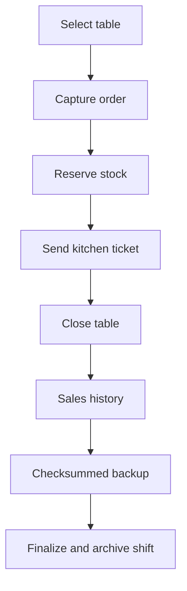

# Rumi Wawqi POS

[](https://github.com/Jsantiagom11/rumi-wawqi-pos/actions/workflows/quality.yml)


Offline-first restaurant operations dashboard designed for weekend service and events in Caraz, Peru. It runs locally on an iPad without a server, printer or permanent internet connection.

**[Read the real operational case study →](docs/case-study.md)**

## Business problem

Rumi Wawqi serves regular weekends and high-volume events. The operation needs a resilient way to coordinate tables, kitchen tickets, menu stock, cash closure and sales reporting even when connectivity is unreliable.

## What the system does

- Table lifecycle and editable table names
- Order capture with inventory reservation
- Kitchen dispatch queue and preparation notes
- Dynamic off-menu items
- Cash totals, average ticket and product mix
- Offline persistence through `localStorage`
- Checksummed JSON shift backups and validated recovery
- Explicit backup-before-finalization workflow
- Revision checks that reject stale writes from another tab
- ISO timestamps and audit-friendly closure snapshots

## Operational flow



## Run locally

The application has no runtime dependencies.

```bash
npm run serve
```

Open `http://localhost:8080`. Keep `index.html` and `core.js` together when copying the offline application.

## Test

Requires Node.js 20+.

```bash
npm test
```

The suite exercises corrupted storage, schema migration, stale writers, quota failures,
backup tampering, active-order finalization blocks, recovery, output escaping and UI wiring.
See [Rainy-day testing](docs/rainy-day-testing.md) for the complete matrix.

## Architecture decisions

| Decision | Reason | Trade-off |
|---|---|---|
| Browser UI plus testable core | Keeps offline deployment simple while making invariants executable | Two files must remain together |
| `localStorage` | No server or account required | Device-local durability |
| Stock reserved on order | Prevents overselling during service | Voided orders must restore stock |
| Checksummed backups | Detects truncation and modification before recovery | User must retain downloaded files |
| Optimistic revision checks | Prevents silent cross-tab overwrites | A rejected action must be repeated |

## Safety improvements in v3

- Replaced destructive **Bajar Caja** behavior with persistent shift backups.
- Added ISO timestamps to sales, orders and kitchen tickets.
- Added validated schema migration and quarantine for corrupt local data.
- Added backup checksums, explicit finalization and guarded recovery.
- Added write verification, quota handling and cross-tab conflict detection.
- Blocked table closure with items not yet sent to kitchen.
- Escaped user-controlled content before rendering it into HTML.
- Renamed misleading **Liberar e Imprimir** action because no printer integration exists.
- Added automated regression checks for critical cash-history invariants.

## Roadmap

- IndexedDB persistence and automatic backup rotation
- Receipt PDF generation and optional print adapter
- Payment-method reconciliation
- Inventory movements and waste tracking
- Cashier authorization and signed closure approvals

See [CHANGELOG.md](CHANGELOG.md) for released capabilities and safety changes.

## Context

This is a real operational product, not a synthetic tutorial. It demonstrates offline product design, workflow automation, inventory control, resilience and delivery decisions under practical infrastructure constraints.
