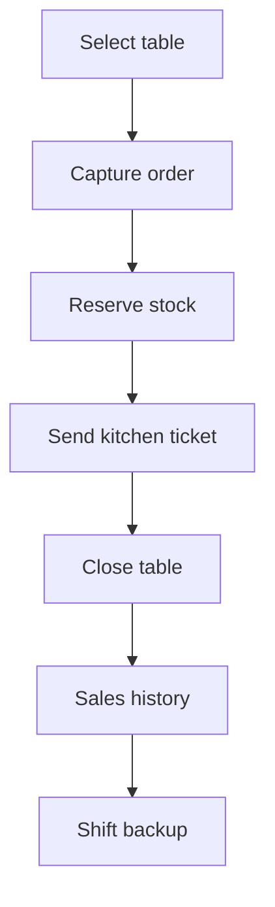

# Rumi Wawqi POS

[](https://github.com/Jsantiagom11/rumi-wawqi-pos/actions/workflows/quality.yml)


Offline-first restaurant operations dashboard designed for weekend service and events in Caraz, Peru. It runs locally on an iPad without requiring a server, printer or permanent internet connection.

**[Read the real operational case study →](docs/case-study.md)**

## Business problem

Rumi Wawqi handles variable weekend demand and occasional higher-volume events. The operation needs a resilient way to coordinate tables, kitchen tickets, menu stock, cash closure and sales reporting even when connectivity is unreliable.

## What the system does

- Table lifecycle and editable table names
- Order capture with inventory reservation
- Kitchen dispatch queue and preparation notes
- Dynamic off-menu items
- Cash totals, average ticket and product mix
- Offline persistence through `localStorage`
- Non-destructive JSON shift backups
- ISO timestamps and audit-friendly closure snapshots

The stock values committed in the source are **demo seed values only**. Real operating stock and sales history stay on the device and are not versioned in this repository.

## Operational flow



## Run locally

The application has no runtime dependencies.

```bash
npm run serve
```

Open `http://localhost:8080`. It can also run directly from `app/index.html`.

## Test

Requires Node.js 20+.

```bash
npm test
```

The regression suite protects the highest-risk invariants: backups cannot erase sales, operational events retain timestamps and legacy iPad data migrates without destructive resets.

## Architecture decisions

| Decision | Reason | Trade-off |
|---|---|---|
| Single-file application | Simple iPad deployment and offline recovery | Larger source file |
| `localStorage` | No server or account required | Device-local durability |
| Stock reserved on order | Prevents overselling during service | Voided orders must restore stock |
| Non-destructive backups | Protects revenue history | Requires explicit archival policy |

## Safety improvements in v2

- Replaced destructive **Bajar Caja** behavior with persistent shift backups.
- Added ISO timestamps to sales, orders and kitchen tickets.
- Added a schema version and migration for existing device data.
- Renamed misleading **Liberar e Imprimir** action because no printer integration exists.
- Added automated regression checks for critical cash-history invariants.

## Roadmap

- Explicit shift-finalization workflow with cashier authorization
- IndexedDB persistence and automatic backup rotation
- Receipt PDF generation and optional print adapter
- Payment-method reconciliation
- Inventory movements and waste tracking
- Import/export recovery screen

See [CHANGELOG.md](CHANGELOG.md) for released capabilities and safety changes.

## Context

This is a real operational product, not a synthetic tutorial. Public documentation intentionally focuses on product behavior and engineering decisions rather than internal service volumes, staffing, revenue or live inventory.
